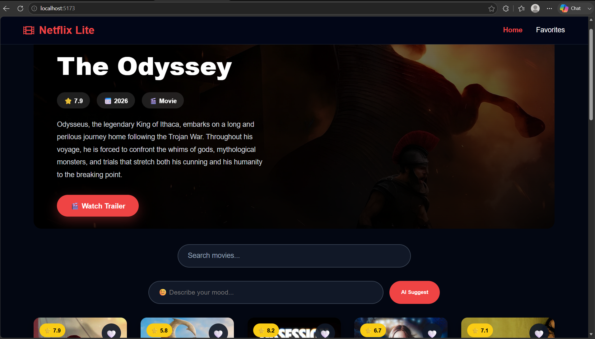
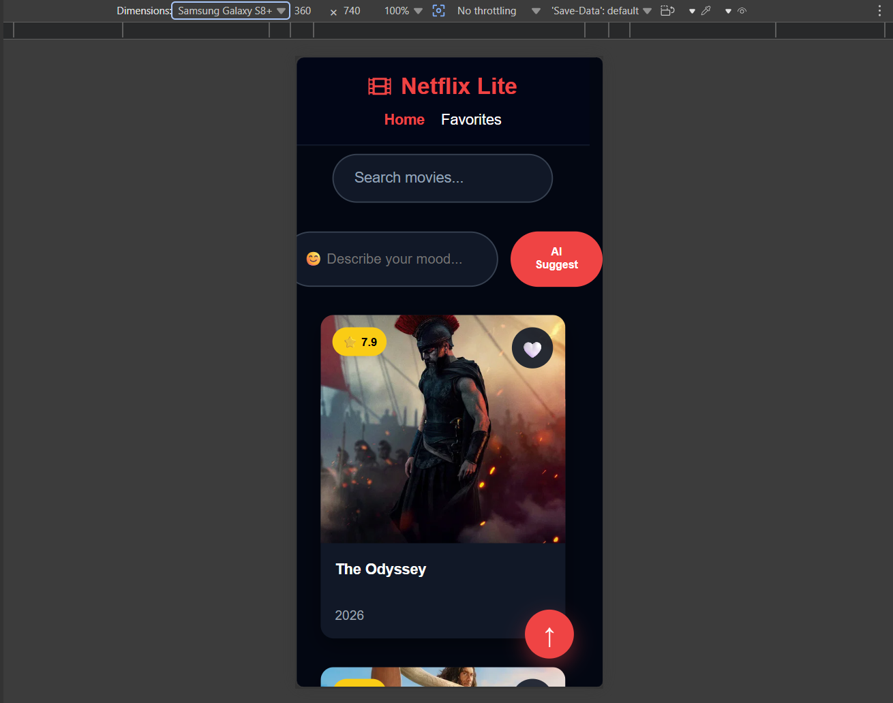
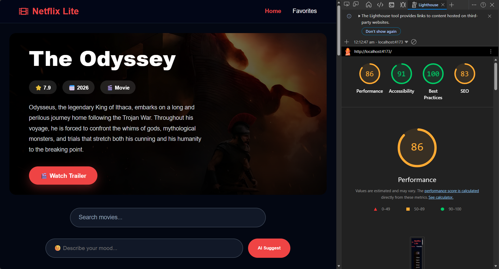

# Netflix-Lite 🎬

A modern Netflix-inspired movie discovery web application built using React.  
The application allows users to explore popular movies, search for movies, discover movies based on moods using AI, and save their favorite movies.

## 🚀 Features

### 🎥 Movie Discovery
- Browse popular movies using TMDB API
- Dynamic movie cards with posters and details
- Featured hero section with trending movie backdrop

### 🔍 Movie Search
- Search movies by title
- Debounced search for optimized API requests
- Infinite scrolling for loading more movies

### 🤖 AI Mood-Based Search
- Users can search movies based on their mood
- AI converts user moods into suitable movie recommendations
- Integrated using OpenRouter API

## Live Demo
https://sprint-8-net.netlify.app/

## Screenshots
### Desktop View

### Mobile View

### Lighthouse Report
